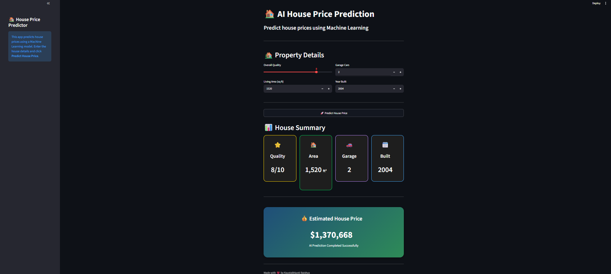

# 🏠 AI House Price Prediction Dashboard

A Machine Learning-powered web application that predicts house prices based on property features using a trained regression model. The application provides an interactive dashboard built with Streamlit, allowing users to input house details and receive an estimated price instantly.

---

## 📸 Preview

 

---

## ✨ Features

* 🤖 Machine Learning house price prediction
* 📊 Interactive Streamlit dashboard
* 🎨 Modern and clean user interface
* 📋 Property summary cards
* 💰 Beautiful price prediction display
* ⚡ Instant predictions
* 📱 Responsive layout

---

## 🛠️ Tech Stack

* Python
* Streamlit
* Scikit-learn
* Pandas
* NumPy
* Joblib

## 🚀 Installation

Clone the repository:

```bash
git clone https://github.com/YOUR_USERNAME/House-Price-Predictor.git
```

Move into the project folder:

```bash
cd House-Price-Predictor
```

Install dependencies:

```bash
pip install -r requirements.txt
```

Run the application:

```bash
streamlit run app.py
```

---

## 🧠 Machine Learning Model

The model was trained using historical housing data to estimate property prices based on features such as:

* Overall Quality
* Living Area
* Garage Capacity
* Year Built

The trained model is saved using **Joblib** and loaded into the Streamlit application for real-time predictions.

---

## 📈 Future Improvements

* Add more house features
* Improve prediction accuracy
* Deploy the application online
* Add charts and visualizations
* Support multiple ML models

---

## 👨‍💻 Author

**Kaustabhjyoti Baishya**
